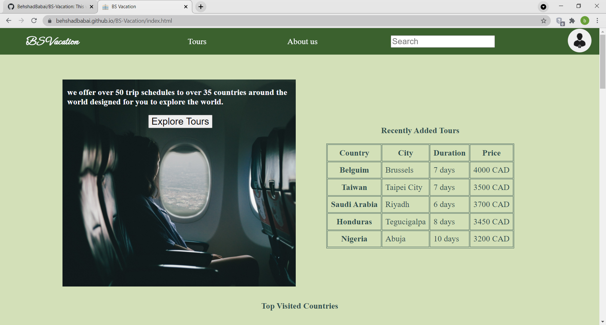
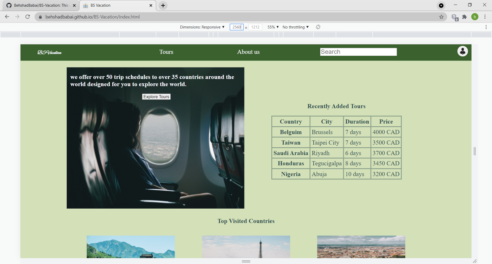
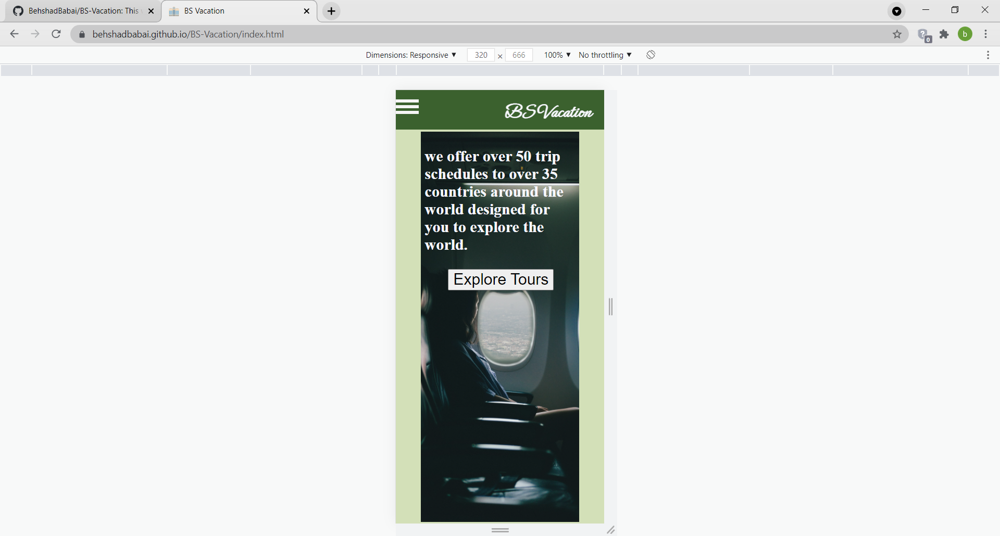
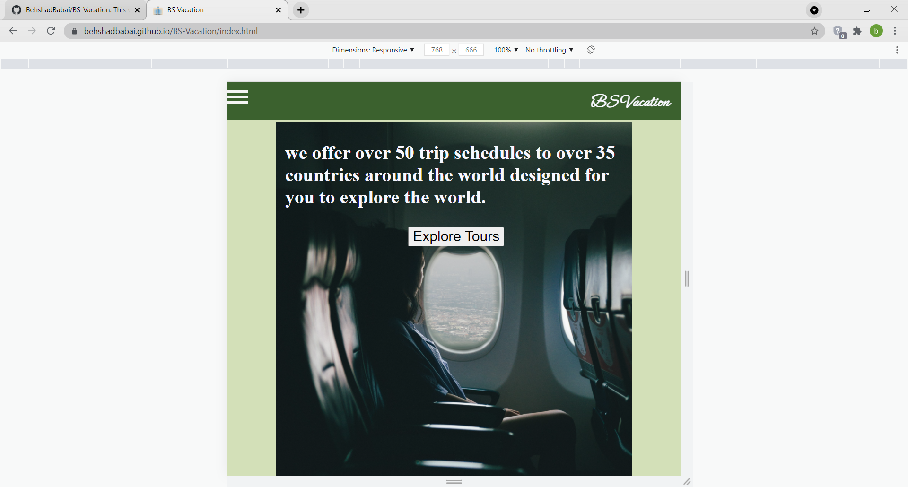

# 
BS Vacation
> The project is a responsive webpage advertising a travel agency company
> <!--Live demo [_here_]().  If you have the project hosted somewhere, include the link here. -->

## Table of Contents
* [General Info](#general-information)
* [Technologies Used](#technologies-used)
* [Screenshots](#screenshots)
* [Setup](#setup)
* [Usage](#usage)
* [Project Status](#project-status)
* [Room for Improvement](#room-for-improvement)
* [Acknowledgements](#acknowledgements)
* [Contact](#contact)
<!-- * [License](#license) -->

## General Information
This webpage is developed to showcase knowledge of developing responsive webpages and aligning elements of a webpage using flexbox and grid. The website is a static website providing information on a travel agency called the BS Vacation. Note that the links and the buttons on this website do not work and this project is just intended to showcase knowledge by displaying the first page of a potential website 
<!-- You don't have to answer all the questions - just the ones relevant to your project. -->

## Technologies Used
-  HTML - version html5
-  CSS
-  git - version 2.32.0.windows.2
-  github

## Screenshots

<!-- If you have screenshots you'd like to share, include them here. -->

## Setup
You can run this program on your local machine by opening the index.html file on a browser having all the files

## Usage
Website displays info about a travel agency

## Project Status
Project is: Complete

## Room for Improvement
- Adding functionality to the website using JavaScript and providing a meaningful links to other pages on the website

## Acknowledgements
- Many thanks to codecademy for including idea for this project on their full-stack development path 

## Contact
Created by Behshad Babai - feel free to contact me via email!
my email: behshad.babai@gmail.com

<!-- Optional -->
<!-- ## License -->
<!-- This project is open source and available under the [... License](). -->

<!-- You don't have to include all sections - just the one's relevant to your project -->
